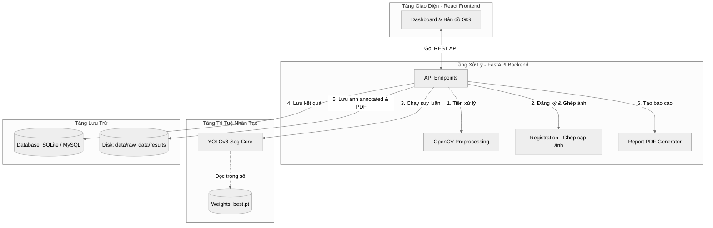
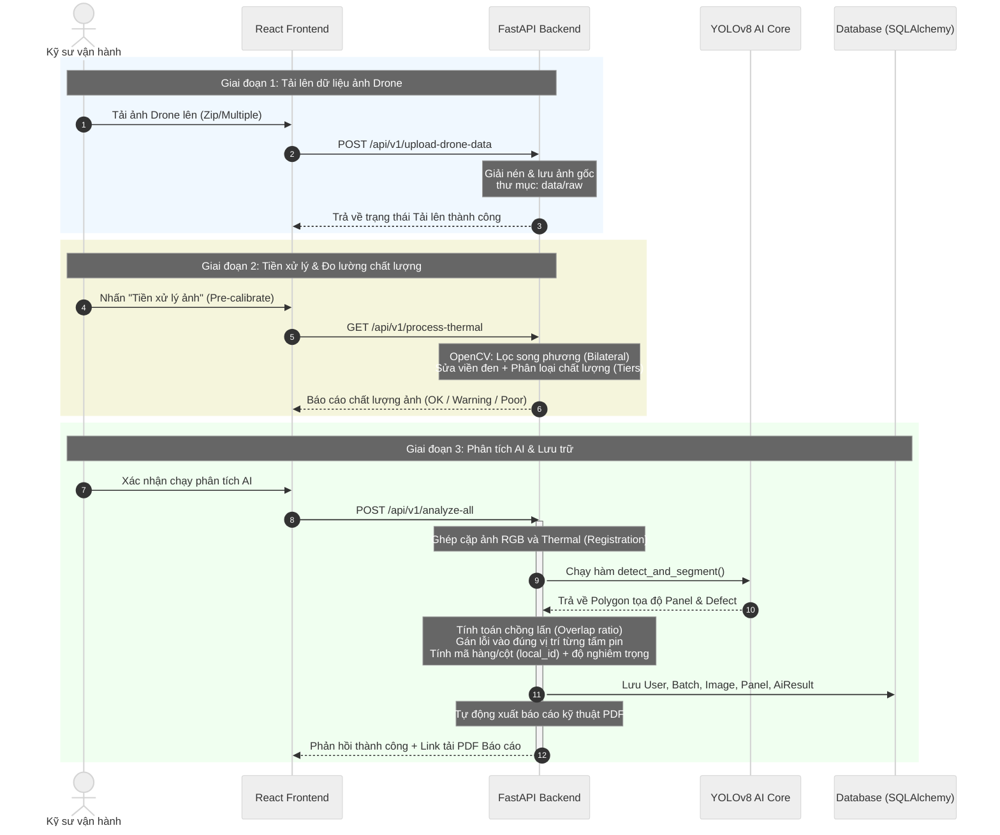
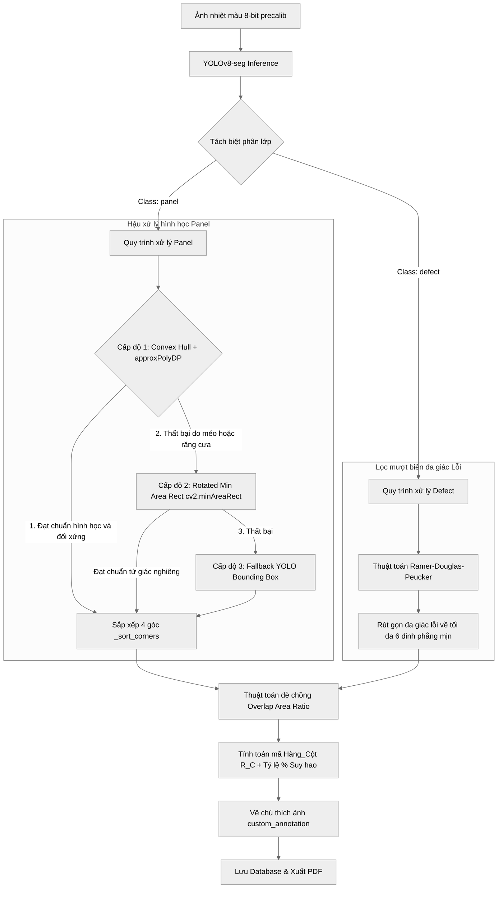
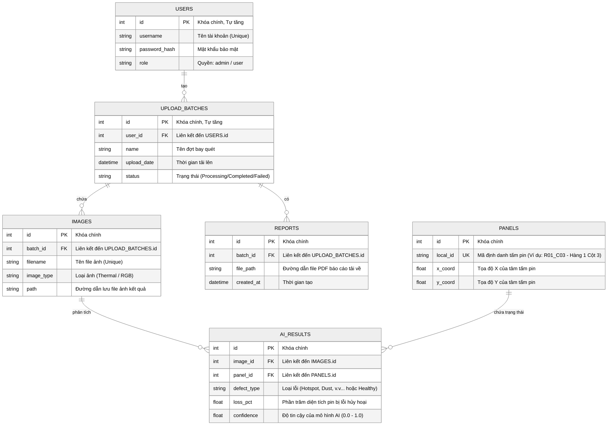

# TÀI LIỆU KIẾN TRÚC HỆ THỐNG & CƠ SỞ DỮ LIỆU
## Dự án: Hệ thống kiểm tra và phát hiện lỗi tấm pin năng lượng mặt trời bằng AI (Solar AI Inspection)

Tài liệu này mô tả trực quan và chi tiết cấu trúc tổng thể của hệ thống, luồng di chuyển của dữ liệu, cấu trúc mạng của mô hình AI và thiết kế các bảng cơ sở dữ liệu.

---

## I. KIẾN TRÚC TỔNG THỂ (SYSTEM ARCHITECTURE)

Hệ thống được thiết kế theo mô hình **3 lớp (3-Tier Architecture)** phân tách trách nhiệm rõ ràng:

---

## II. LUỒNG HOẠT ĐỘNG CHI TIẾT (DATA FLOW SEQUENCE)

Biểu đồ tuần tự dưới đây mô tả luồng đi của dữ liệu từ khi kỹ sư tải ảnh lên cho đến khi hệ thống tự động xuất báo cáo lỗi pin:

---

## III. THUẬT TOÁN & CẤU TRÚC MÔ HÌNH AI (AI ENGINE PIPELINE)

Hệ thống sử dụng mô hình học sâu **YOLOv8 Instance Segmentation (YOLOv8-seg)** để đồng thời nhận diện vị trí các tấm pin quang điện (`panel`) và phân mảnh các vùng dị thường nhiệt (`defect`). 

### 1. Sơ đồ xử lý của công cụ AI (AI Pipeline Flowchart)

### 2. Các ngưỡng tin cậy (Confidence Thresholds)
*   **Ngưỡng tin cậy của Panel (`PANEL_CONF_THRESHOLD = 0.9`):** Panel được thiết lập ngưỡng tin cậy rất cao nhằm đảm bảo tính cấu trúc hệ thống, tránh nhận diện nhầm các chi tiết ngoại cảnh làm ảnh hưởng tới việc đánh giá lưới pin.
*   **Ngưỡng tin cậy của Defect (`DEFECT_CONF_THRESHOLD = 0.2`):** Thiết lập ngưỡng tin cậy thấp hơn để giữ bộ lọc nhạy bén tối đa, tránh bỏ sót các điểm hotspot hoặc vết nứt vỡ (cracks) rất nhỏ mới hình thành.

### 3. Danh sách phân lớp lỗi AI (Dataset Classes)
Mô hình phát hiện và gom nhóm các lớp đối tượng bao gồm:
*   `panel`: Tấm pin mặt trời (Vật thể cần định vị).
*   `defect` (Các lớp con gây tổn hao hiệu suất):
    *   `hotspot_single_cell`: Điểm nóng cục bộ trên một cell pin.
    *   `hotspot_multi_cell`: Điểm nóng loang rộng trên nhiều cell liền kề.
    *   `shading`: Bị bóng che (do lá cây, phân chim, dị vật che khuất).
    *   `soiling`: Bám bụi bẩn tích tụ lâu ngày làm giảm khả năng hấp thụ quang học.
    *   `crack`: Tấm pin bị nứt vỡ vật lý dẫn tới ngắt mạch.

### 4. Thuật toán hậu xử lý đặc biệt (Specialized Algorithms)
*   **Thuật toán `refine_panel_contour`:** Ứng dụng quy trình OpenCV 3 cấp độ (Convex Hull, Rotated Rectangle, approxPolyDP) để chỉnh sửa các đa giác răng cưa từ AI trở thành hình tứ giác hoàn hảo khớp phối cảnh (perspective), loại bỏ hoàn toàn hiện tượng lem đường bao sang tấm pin lân cận.
*   **Thuật toán `_sort_corners`:** Định vị chính xác tọa độ centroid (trung tâm) và tính toán góc quét lượng giác để luôn sắp xếp 4 đỉnh theo thứ tự kim đồng hồ chuẩn: `[Top-Left, Top-Right, Bottom-Right, Bottom-Left]`, làm cơ sở dữ liệu chính xác cho việc tính toán hình học GIS.
*   **Thuật toán `simplify_defect_polygon`:** Sử dụng bộ đơn giản hóa đa giác Ramer-Douglas-Peucker (RDP) thích ứng, rút gọn các vùng lỗi lởm chởm về tối đa 6 đỉnh để tăng tốc độ hiển thị và đảm bảo tính thẩm mỹ cao trên giao diện GIS Frontend.

---

## IV. THIẾT KẾ CƠ SỞ DỮ LIỆU (DATABASE SCHEMA)

Cơ sở dữ liệu được thiết kế chuẩn hóa để tối ưu hóa việc truy vấn hiệu suất của từng tấm pin mặt trời qua từng đợt bay quét khác nhau.

### 1. Sơ đồ mối quan hệ thực thể (ERD Diagram)

---

## V. ĐẶC TẢ CHI TIẾT CÁC BẢNG DỮ LIỆU (DATA DICTIONARY)

> [!TIP]
> Bảng dữ liệu đã được phân tách rõ ràng thành hai phần: **Thông tin địa lý cố định (`panels`)** và **Thông tin động theo thời gian (`ai_results`, `images`)**. Cách thiết kế này giúp bạn dễ dàng vẽ biểu đồ theo dõi hiệu suất/suy hao của cùng một tấm pin qua nhiều tháng/năm.

### 1. Bảng `users` (Thông tin tài khoản)
| Tên Trường | Kiểu Dữ Liệu | Thuộc tính | Mô tả |
| :--- | :--- | :--- | :--- |
| `id` | Integer | PK, Auto Increment | Mã số tự tăng của người dùng |
| `username` | String(50) | Unique, Index | Tên tài khoản dùng để đăng nhập |
| `password_hash`| String(255) | | Mật khẩu tài khoản (Đã mã hóa một chiều) |
| `role` | String(20) | Default: "user" | Phân quyền truy cập hệ thống (admin / user) |

### 2. Bảng `upload_batches` (Lịch sử các đợt kiểm tra)
| Tên Trường | Kiểu Dữ Liệu | Thuộc tính | Mô tả |
| :--- | :--- | :--- | :--- |
| `id` | Integer | PK, Auto Increment | Mã số định danh của đợt bay quét |
| `user_id` | Integer | FK (`users.id`), Nullable | Kỹ sư trực tiếp thực hiện tải lên |
| `name` | String(255) | | Tên gọi (VD: "Đợt kiểm tra tự động tháng 5") |
| `upload_date` | DateTime | Server Default: `now()` | Ngày giờ hệ thống nhận được dữ liệu |
| `status` | String(50) | Default: "Completed" | Trạng thái xử lý: Processing, Completed, Failed |

### 3. Bảng `images` (Danh sách ảnh bay chụp)
| Tên Trường | Kiểu Dữ Liệu | Thuộc tính | Mô tả |
| :--- | :--- | :--- | :--- |
| `id` | Integer | PK, Auto Increment | Mã số ảnh |
| `batch_id` | Integer | FK (`upload_batches.id`) | Đợt bay quét chứa ảnh này |
| `filename` | String(255) | | Tên file vật lý lưu trữ (VD: `frame_123_thermal.jpg`) |
| `image_type` | String(50) | | Phân loại dữ liệu ảnh đầu vào: "Thermal" hoặc "RGB" |
| `path` | String(500) | | Đường dẫn chính xác của file kết quả trên ổ đĩa server |

### 4. Bảng `panels` (Định vị tấm pin mặt trời)
| Tên Trường | Kiểu Dữ Liệu | Thuộc tính | Mô tả |
| :--- | :--- | :--- | :--- |
| `id` | Integer | PK, Auto Increment | Mã số định danh duy nhất của tấm pin |
| `local_id` | String(50) | Unique, Index | Vị trí tấm pin trên bản đồ (VD: `R03_C11` - Hàng 3 Cột 11) |
| `x_coord` | Float | | Tọa độ điểm X của tâm tấm pin trên không gian ảnh |
| `y_coord` | Float | | Tọa độ điểm Y của tâm tấm pin trên không gian ảnh |

### 5. Bảng `ai_results` (Kết quả phân tích lỗi của AI)
| Tên Trường | Kiểu Dữ Liệu | Thuộc tính | Mô tả |
| :--- | :--- | :--- | :--- |
| `id` | Integer | PK, Auto Increment | Mã kết quả AI |
| `image_id` | Integer | FK (`images.id`) | Ảnh chụp chứa tấm pin bị lỗi này |
| `panel_id` | Integer | FK (`panels.id`) | Tấm pin mặt trời cụ thể đang bị lỗi |
| `defect_type` | Text | Nullable | Các lỗi AI phát hiện (VD: Hotspot, Dust, Multi-line... hoặc Healthy) |
| `loss_pct` | Float | Default: 0.0 | Tỉ lệ phần trăm suy hao diện tích tấm pin bị hỏng |
| `confidence` | Float | Default: 0.0 | Độ tin cậy dự đoán của thuật toán (0.0 -> 1.0) |

### 6. Bảng `reports` (Báo cáo xuất PDF)
| Tên Trường | Kiểu Dữ Liệu | Thuộc tính | Mô tả |
| :--- | :--- | :--- | :--- |
| `id` | Integer | PK, Auto Increment | Mã số báo cáo |
| `batch_id` | Integer | FK (`upload_batches.id`) | Đợt kiểm tra được biên tập thành báo cáo |
| `file_path` | String(500) | | Đường dẫn lưu trữ file báo cáo dạng PDF trên máy chủ |
| `created_at` | DateTime | Server Default: `now()` | Ngày giờ báo cáo này được biên soạn |

---

## VI. ĐÁNH GIÁ THIẾT KẾ KIẾN TRÚC (ARCHITECTURAL REVIEW)

> [!IMPORTANT]
> **Điểm cộng của thiết kế:**
> *   **Tách biệt dữ liệu địa chất tĩnh và động:** Bằng cách tách biệt dữ liệu định vị pin (`panels`) và kết quả lỗi động theo thời gian (`ai_results`), hệ thống có khả năng chạy phân tích lỗi cho cùng một khu vực pin năng lượng mặt trời nhiều lần qua nhiều năm để vẽ biểu đồ so sánh xu hướng suy hao.
> *   **Khả năng chịu tải và mở rộng hệ thống:** Lớp xử lý AI (`YOLOv8`) có thể tách rời ra một GPU Server độc lập khi hệ thống phát triển lớn hơn, chỉ cần sửa đổi API REST gọi sang mà không phải cấu hình lại toàn bộ Database hay Frontend.
